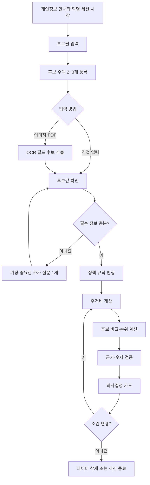
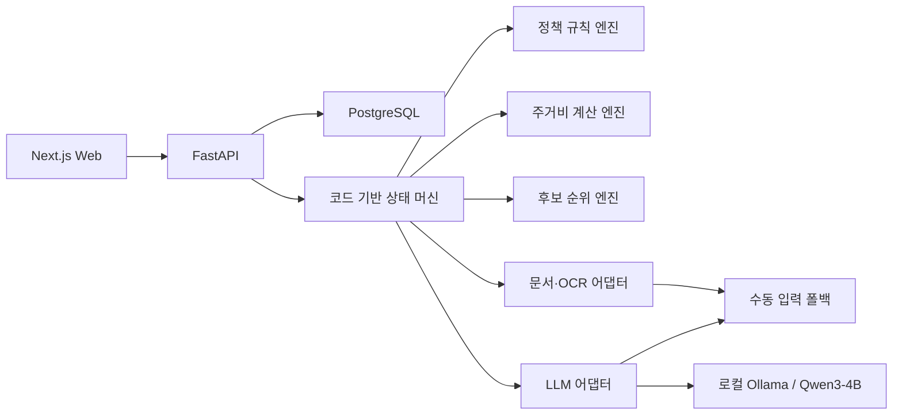

# 집결정 AI Phase 1 — UX·아키텍처·개발 기반

## 1. 완료 결과

- 상태: **완료**
- 기준일: 2026-07-21
- Web: Next.js + TypeScript
- API: FastAPI + Python
- 로컬 LLM: Ollama + `qwen3:4b`
- 데이터베이스: PostgreSQL 예정, Phase 2에서 스키마 구현
- 핵심 원칙: LLM이나 OCR이 없어도 수동 입력 경로로 계산·비교를 계속할 수 있다.

---

## 2. 사용자 흐름



### 단계별 UX 규칙

1. 서비스 시작 전에 사전자격·대출·계약 안전성을 보장하지 않는다고 알린다.
2. 익명 세션을 기본으로 사용하며 주민등록번호와 계좌번호를 받지 않는다.
3. 문서 추출값은 자동 확정하지 않고 원문과 함께 수정·확정하게 한다.
4. 필수값이 부족하면 결과를 만들지 않고 가장 영향이 큰 질문 하나만 보여준다.
5. 결과 화면은 순위보다 계산 근거, 정책 기준일과 불확실성을 먼저 설명한다.
6. 사용자가 조건을 바꾸면 새 결과와 이전 결과의 차이를 함께 보여준다.
7. 종료 화면에서 데이터 즉시 삭제 기능을 제공한다.

---

## 3. 모바일 우선 와이어프레임

### 3.1 시작 화면

```text
┌──────────────────────────────┐
│ 집을 찾는 것에서 결정까지   │
│                              │
│ [서비스 한계와 개인정보 안내]│
│                              │
│      [익명으로 시작하기]     │
└──────────────────────────────┘
```

### 3.2 입력 화면

```text
┌──────────────────────────────┐
│ 1/3 내 조건                  │
│ 월 세후소득  [          ] 원 │
│ 사용가능 보증금 [       ] 원 │
│ 월 출근일수  [          ] 일 │
│                              │
│ 2/3 후보 주택                │
│ [직접 입력] [이미지·PDF]     │
│                              │
│         [다음]               │
└──────────────────────────────┘
```

### 3.3 추출 확인 화면

```text
┌──────────────────────────────┐
│ 문서에서 읽은 내용을 확인해요│
│ [원문 이미지]                │
│ 보증금 [10,000,000]  신뢰 높음│
│ 월세   [500,000]     신뢰 높음│
│ 관리비 [미상]        확인 필요│
│                              │
│       [수정값 확정]          │
└──────────────────────────────┘
```

### 3.4 결과 화면

```text
┌──────────────────────────────┐
│ 현재 조건의 추천: B주택      │
│ 조건부 추천 · 지원금 미반영  │
│                              │
│ 월 실질비용      78만원      │
│ 소득 대비 부담률 31.2%       │
│                              │
│ 왜 B인가요?                  │
│ 비용 + 통근 + 보증금 기여도  │
│                              │
│ 정책 사전자격 / 확인 필요    │
│ 공식 출처 · 2026-07-21 확인 │
│                              │
│ [조건 바꾸기] [데이터 삭제]  │
└──────────────────────────────┘
```

---

## 4. 시스템 구성과 책임 경계



| 영역 | 책임 | 하지 않는 일 |
| --- | --- | --- |
| Web | 입력·수정·비교·상태 표시 | 정책 판정과 금액 계산 |
| API | 검증, 워크플로, 오류 형식, 접근 경계 | 정책 조건 임의 생성 |
| LLM 어댑터 | Ollama 통신, JSON 생성, 상태 확인 | 자격 판정·계산·자유로운 도구 실행 |
| OCR 어댑터 | 텍스트·좌표 후보 반환 | 값을 자동 확정 |
| 규칙 엔진 | 버전형 정책 사전자격 판정 | 사용자 설명문 자유 생성 |
| 계산 엔진 | Decimal 기반 비용·부담률 계산 | 자연어 추정 |
| 순위 엔진 | 공개 가중치로 점수·민감도 계산 | 설명 없는 블랙박스 추천 |
| DB | 입력 스냅샷·버전·결과·삭제 상태 | 원본 문서 무기한 보관 |

---

## 5. Phase 1 API 계약

FastAPI가 `/openapi.json`과 `/docs`를 자동 생성하며 Phase 1에서 실제 구현한 계약은 다음과 같다.

| Method | Path | 응답 | 장애 처리 |
| --- | --- | --- | --- |
| `GET` | `/health` | API 서비스와 환경 상태 | API 자체 장애 시 HTTP 오류 |
| `GET` | `/system/llm` | Ollama·모델 준비 상태 | 항상 상태 객체를 반환하고 수동 폴백 여부 표시 |

### `GET /system/llm`

```json
{
  "provider": "ollama",
  "model": "qwen3:4b",
  "state": "ready",
  "manual_fallback": false,
  "detail": "로컬 LLM을 사용할 수 있습니다."
}
```

`state` 허용값:

- `ready`
- `disabled`
- `model_missing`
- `unavailable`

후속 API의 공통 오류 형식은 Phase 2부터 아래 계약을 사용한다.

```json
{
  "error": {
    "code": "VALIDATION_ERROR",
    "message": "입력값을 확인해 주세요.",
    "fields": [
      {"field": "monthly_income", "reason": "0보다 커야 합니다."}
    ]
  }
}
```

오류 메시지에는 프롬프트, 문서 원문, 내부 예외 스택과 개인정보를 포함하지 않는다.

---

## 6. Qwen3-4B 어댑터 계약

`LanguageModelGateway` 인터페이스는 다음 두 기능만 노출한다.

- `status()`: Ollama 연결과 대상 모델 설치 여부 확인
- `generate_json()`: 시스템 지시와 사용자 입력을 전달하고 JSON 객체 수신

구현 규칙:

- 기본 모델은 환경변수 `LLM_MODEL=qwen3:4b`로 설정한다.
- `format=json`, `stream=false`를 사용한다.
- 컨텍스트, 최대 출력, 온도와 타임아웃을 환경변수로 제한한다.
- 비즈니스 규칙은 어댑터에 넣지 않는다.
- 모델 오류를 부적격이나 추천 결과로 변환하지 않는다.
- 실제 기능에서는 반환 JSON을 기능별 Pydantic 스키마로 한 번 더 검증한다.
- 검증 실패 시 1회만 형식 수정 요청 후 수동 경로로 전환한다.

---

## 7. 수동 폴백 설계

| 장애 | 사용자에게 보이는 상태 | 계속 가능한 기능 |
| --- | --- | --- |
| Ollama 미실행 | `수동 모드` | 프로필·후보 직접 입력, 계산, 정책 판정 |
| Qwen 모델 없음 | 설치 필요 안내 | 직접 입력과 템플릿 결과 |
| LLM JSON 오류 | 설명 생성 보류 | 결정론적 숫자와 사유 코드 표시 |
| OCR 장애 | 문서 자동 추출 불가 | 후보 필드 직접 입력 |
| 지도 API 미사용 | 통근 자동 조회 불가 | 통근시간·월 교통비 직접 입력 |
| 정책 원문 만료 | 공식 확인 필요 | 비용 비교, 해당 정책 제외 |

웹 초기 화면은 `/system/llm` 결과를 읽어 `사용 가능` 또는 `수동 모드`를 표시한다. 수동 모드는 실패 화면이 아니라 정상적인 대체 경로다.

---

## 8. 환경 분리와 비밀정보

| 환경 | 데이터 | LLM | 목적 |
| --- | --- | --- | --- |
| 개발 | 합성·로컬 데이터 | 로컬 Ollama | 기능 개발 |
| 테스트 | 고정 fixture | MockTransport·가짜 게이트웨이 | 재현 가능한 자동 테스트 |
| 데모 | 합성 시나리오 | 로컬 Ollama | 경진대회 시연 |

- `.env.example`만 Git에 포함하고 실제 `.env`는 포함하지 않는다.
- 현재 LLM에는 API 키가 필요 없다.
- 실제 개인정보가 들어간 파일은 저장소에 추가하지 않는다.
- 외부 공급자가 추가되면 키는 환경변수로만 주입한다.

---

## 9. 로컬 실행 명령

최초 1회:

```powershell
Copy-Item .env.example .env
ollama pull qwen3:4b
npm install
python -m venv .venv
.\.venv\Scripts\Activate.ps1
python -m pip install -r requirements-dev.lock
```

평상시 실행:

```powershell
npm run db:up
npm run dev
```

개별 실행:

```powershell
npm run dev:web
npm run dev:api
```

검사:

```powershell
npm run lint
npm run typecheck
npm run test
```

PowerShell 실행 정책 때문에 `npm.ps1`이 차단되면 정책을 바꾸지 않고 `npm.cmd`를 사용할 수 있다.

```powershell
npm.cmd run test
```

---

## 10. 아키텍처 의사결정 기록

### ADR-001: 로컬 Qwen3-4B를 어댑터 뒤에 둔다

- 상태: 승인
- 이유: API 비용 없이 반복 실행하고 모델 교체가 비즈니스 코드에 퍼지는 것을 막기 위함
- 결과: API는 `LanguageModelGateway`에만 의존한다.

### ADR-002: 자유 계획형 에이전트를 사용하지 않는다

- 상태: 승인
- 이유: 4B 모델에서 도구 선택과 장기 계획의 변동성을 줄이기 위함
- 결과: 서버 상태 머신이 다음 단계를 결정하며 Qwen은 제한된 출력만 만든다.

### ADR-003: 수동 입력을 정상 폴백으로 유지한다

- 상태: 승인
- 이유: OCR·LLM·지도 기능 장애가 핵심 비용 계산을 막지 않게 하기 위함
- 결과: 모든 외부 기능은 비활성화 가능하며 UI가 대체 입력을 제공한다.

### ADR-004: PostgreSQL과 도메인 엔진 구현은 Phase 2 이후로 미룬다

- 상태: 승인
- 이유: Phase 1에서는 경계와 실행 기반만 고정하고 데이터 모델을 성급히 확정하지 않기 위함
- 결과: 현재 DB 컨테이너만 유지하고 테이블·마이그레이션은 Phase 2에서 구현한다.

---

## 11. 테스트 결과와 완료 점검

검증 결과:

- Ruff lint 통과
- mypy strict 타입 검사 통과
- ESLint 통과
- TypeScript 타입 검사 통과
- FastAPI 자동 테스트 통과
- Vitest 자동 테스트 통과
- Next.js 프로덕션 빌드 통과
- 실제 Ollama 상태 응답 `ready` 확인
- 실제 Qwen3-4B JSON 생성 응답 `{"status": "ready"}` 확인

- [x] Ollama 0.32.1 설치를 확인했다.
- [x] `qwen3:4b` 2.5GB 모델 설치를 확인했다.
- [x] API 헬스체크 계약이 있다.
- [x] Ollama 상태 확인 API와 어댑터 경계를 구현했다.
- [x] 웹에서 로컬 AI 상태와 수동 폴백 상태를 표시한다.
- [x] 사용자 흐름과 모바일 와이어프레임을 작성했다.
- [x] 시스템 책임과 데이터 흐름을 정의했다.
- [x] OpenAPI 초안과 오류 형식을 정의했다.
- [x] 환경·비밀정보·로컬 명령을 문서화했다.
- [x] OCR·LLM 없이 진행 가능한 수동 경로를 정의했다.

Phase 2 전달사항:

1. 프로필·후보·정책·판정·계산에 사용할 DB 스키마와 API 스키마를 정의한다.
2. 공통 오류 응답을 FastAPI 예외 처리기로 구현한다.
3. 익명 세션, 입력 스냅샷, 보관기한과 삭제 상태를 구현한다.
4. 모든 테스트 데이터는 합성 데이터로 작성한다.
