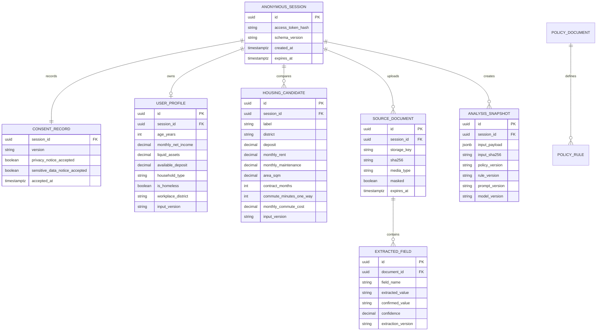
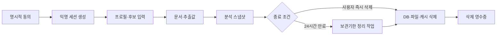

# 집결정 AI Phase 2 — 데이터 모델·개인정보 기반

## 1. 완료 결과

- 상태: **완료**
- 기준일: 2026-07-24
- API 데이터 모델: Pydantic v2
- 로컬·테스트 저장소: 저장소 인터페이스 뒤의 메모리 구현
- 영속 저장소 계약: PostgreSQL 17 마이그레이션
- 인증 방식: 익명 세션 UUID + 32바이트 이상 접근 토큰
- 원본 기본 보관기간: 24시간
- 테스트 데이터: 실제 개인정보가 없는 합성 데이터

Phase 2는 계산·정책 규칙을 구현하는 단계가 아니다. 이후 엔진이 동일 입력과 버전으로 결과를 재현할 수 있도록 데이터 구조, 접근 경계, 삭제와 보관기간을 먼저 고정한다.

---

## 2. 핵심 데이터 결정

1. 사용자 계정 대신 만료되는 익명 세션을 사용한다.
2. 세션 UUID만으로 데이터에 접근할 수 없으며 별도 `X-Session-Token`이 필요하다.
3. 토큰 원문은 저장하지 않고 SHA-256 해시만 저장한다.
4. 주민등록번호, 계좌번호, 신분증 원본은 수집하지 않는다.
5. 주소와 직장 위치는 MVP에서 구 단위 문자열만 저장한다.
6. 모든 금액은 값과 통화 `KRW`를 함께 표현한다.
7. 사용자 프로필과 후보 입력에 스키마 버전을 저장한다.
8. 분석 입력에는 정책·규칙·프롬프트·모델 버전과 입력 해시를 남긴다.
9. OCR 추출값과 사용자 확정값은 별도 필드로 보존한다.
10. 지원·선정되지 않은 정책 금액은 확정 비용과 구분한다.

---

## 3. ERD



PostgreSQL 정의는 `apps/api/migrations/001_phase2.sql`에 있다. Docker가 빈 데이터 볼륨으로 시작할 때 `/docker-entrypoint-initdb.d`를 통해 생성된다.

현재 API 기본값은 `DATA_REPOSITORY=memory`다. 테스트와 초기 수직 흐름을 외부 DB 없이 재현하기 위한 선택이며, 실제 배포 전에 같은 `DataRepository` 인터페이스의 PostgreSQL 구현으로 교체한다. 영속 스키마와 API 계약은 이 Phase에서 고정했다.

---

## 4. API 계약

| Method | Path | 인증 | 기능 |
| --- | --- | --- | --- |
| `POST` | `/sessions` | 없음 | 동의 기록과 익명 세션 생성 |
| `PUT` | `/sessions/{id}/profile` | 세션 토큰 | 프로필 생성·수정 |
| `POST` | `/sessions/{id}/candidates` | 세션 토큰 | 후보 주택 추가, 최대 3개 |
| `GET` | `/sessions/{id}/export` | 세션 토큰 | 해당 세션 데이터 내보내기 |
| `DELETE` | `/sessions/{id}` | 세션 토큰 | DB·파일·캐시 삭제 결과 반환 |

인증 헤더:

```http
X-Session-Token: <세션 생성 시 한 번 반환된 토큰>
```

### 세션 생성 예시

```json
{
  "consent_version": "privacy-v1",
  "privacy_notice_accepted": true,
  "sensitive_data_notice_accepted": true
}
```

동의 항목 중 하나라도 거절하면 세션을 생성하지 않는다.

### 금액 형식

```json
{
  "amount": "550000.00",
  "currency": "KRW"
}
```

금액은 부동소수점 오차를 피하기 위해 백엔드에서 `Decimal`로 처리한다. 음수 금액은 스키마 검증 단계에서 거부한다.

### 공통 오류 형식

```json
{
  "error": {
    "code": "VALIDATION_ERROR",
    "message": "입력값을 확인해 주세요.",
    "fields": [
      {
        "field": "age_years",
        "reason": "Input should be greater than or equal to 19"
      }
    ]
  }
}
```

허용 오류 코드:

- `VALIDATION_ERROR`
- `BAD_REQUEST`
- `FORBIDDEN`
- `NOT_FOUND`
- `HTTP_ERROR`

---

## 5. 입력 스냅샷과 재현성

분석 실행 시 다음 값을 하나의 `AnalysisSnapshot`으로 저장한다.

- 확정된 프로필과 후보 입력
- 정책 문서 버전
- 정책 규칙 버전
- 프롬프트 버전
- 모델 버전
- 생성 시각
- 정렬된 JSON의 SHA-256 해시

JSON 키 순서가 달라도 값이 같으면 같은 해시가 생성된다. Phase 3 계산 엔진과 Phase 4 규칙 엔진은 이 스냅샷만 입력으로 받아 같은 결과를 재현해야 한다.

---

## 6. 개인정보 분류·처리표

| 데이터 | 분류 | 수집 여부 | 저장 방식 | 보관·삭제 |
| --- | --- | --- | --- | --- |
| 나이 | 필수 | 수집 | 만 나이 숫자 | 세션과 함께 삭제 |
| 월 세후소득 | 필수 민감 | 수집 | KRW Decimal | 세션과 함께 삭제 |
| 유동자산·보증금 | 필수 민감 | 수집 | KRW Decimal | 세션과 함께 삭제 |
| 가구형태·무주택 여부 | 필수 민감 | 수집 | 범주형 값 | 세션과 함께 삭제 |
| 희망 주거·직장 지역 | 선택 | 구 단위만 | 문자열 | 세션과 함께 삭제 |
| 정확한 주소 | 제한 | Phase 2 미수집 | 해당 없음 | 해당 없음 |
| 매물 문서 | 선택 민감 | Phase 6 예정 | 세션별 제한 저장 | 기본 24시간·즉시 삭제 |
| 주민등록번호 | 금지 | 미수집 | 입력·로그에서 차단 | 저장하지 않음 |
| 계좌번호 | 금지 | 미수집 | 입력·로그에서 차단 | 저장하지 않음 |
| 신분증 원본 | 금지 | 미수집 | 업로드 대상 제외 | 저장하지 않음 |
| 접근 토큰 | 인증정보 | 1회 반환 | SHA-256 해시만 저장 | 세션과 함께 삭제 |

---

## 7. 데이터 생명주기



삭제 구현 원칙:

- 세션 토큰이 맞는 요청만 삭제할 수 있다.
- 세션 레코드와 연결된 프로필·후보·문서·스냅샷을 삭제한다.
- 업로드 루트 안에서 해당 세션에 등록된 정확한 파일만 삭제한다.
- 업로드 루트 밖의 파일은 삭제하지 않는다.
- 삭제 결과에 레코드·파일·캐시 삭제 수를 반환한다.
- 원본 파일 경로와 접근 토큰은 내보내기 응답에 포함하지 않는다.

보관기간 만료 정리는 `purge_expired()`로 구현하고 자동 테스트한다. 실제 운영 스케줄러 연결은 Phase 10에서 수행한다.

---

## 8. 로그 마스킹

로그 필터는 다음 값을 `[REDACTED]`로 치환한다.

- 주민등록번호 형태
- 하이픈이 포함된 계좌번호 형태
- `access_token`, `account_number`, `rrn`, `document_text` 등 금지 키

서비스 코드는 원문 문서와 전체 요청 본문을 로그 메시지로 남기지 않는다. 마스킹은 실수에 대한 보조 방어이며, 애초에 민감정보를 로깅하지 않는 것이 우선이다.

---

## 9. 합성 테스트 데이터

자동 테스트는 다음 가상 사용자만 사용한다.

- 만 27세
- 월 세후소득 250만 원
- 유동자산 1,500만 원
- 사용 가능한 보증금 1,000만 원
- 서울 중구 직장
- 서울 마포구 A주택: 보증금 1,000만 원, 월세 55만 원, 관리비 7만 원

이 데이터는 실제 개인이나 실제 계약서에서 가져오지 않았다.

---

## 10. 테스트 결과와 완료 점검

검증 대상:

- 연령·금액·면적·계약기간 범위 검증
- 동의 거절 시 세션 생성 차단
- 잘못된 세션 토큰 접근 차단
- 프로필·후보 저장과 데이터 내보내기
- 세션 삭제 후 접근 불가
- 등록된 원본 파일 삭제
- 업로드 루트 밖의 파일 삭제 방지
- 만료 세션 자동 정리
- 정리 작업 전에도 만료 세션 접근 차단
- 입력 스냅샷 해시 재현성
- 주민등록번호·계좌번호 로그 마스킹

실행 결과:

- Python 자동 테스트 18개 통과
- 전체 Python 테스트 커버리지 93%
- Ruff lint 통과
- mypy strict 타입 검사 통과
- OpenAPI에 Phase 2 경로 5개와 데이터 스키마가 생성됨
- Docker Compose 마이그레이션 마운트 구성 검증 통과

완료 조건:

- [x] 동일 입력과 버전으로 재현할 수 있는 스냅샷 구조가 있다.
- [x] 데이터 삭제와 보관기간 정리가 자동 테스트로 검증된다.
- [x] 원본 문서는 세션 토큰과 등록된 저장경로를 통해서만 접근하도록 설계됐다.
- [x] 실제 개인정보 없이 합성 데이터로 전체 자동 테스트가 가능하다.
- [x] PostgreSQL 테이블과 제약조건 마이그레이션이 있다.
- [x] 입력·출력 JSON Schema가 OpenAPI에 노출된다.
- [x] 공통 오류 형식이 구현됐다.
- [x] 개인정보 로그 마스킹이 구현됐다.

---

## 11. Phase 3 전달사항

1. 계산 엔진 입력은 `UserProfile`, `HousingCandidate`의 확정값만 사용한다.
2. 모든 금액은 `Money.amount`의 Decimal 값을 사용한다.
3. 계산 직전에 입력·계산식 버전으로 `AnalysisSnapshot`을 생성한다.
4. 관리비가 `null`이면 임의로 0원 처리하지 않고 정보부족 또는 별도 시나리오로 처리한다.
5. 지원금은 확정 지원과 예상 지원을 구분한다.
6. 계산 결과와 중간값은 LLM 생성문이 아닌 구조화 데이터로 저장한다.
