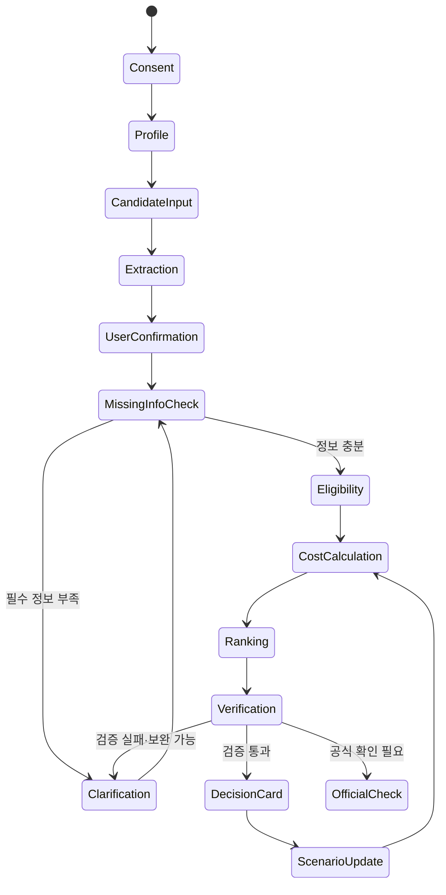

# 집결정 AI 단계별 개발 로드맵

## 0. 문서 목적

이 문서는 [청년 주거 금융 도우미 기획안](./청년_주거_금융_도우미_기획안.md)을 실제 서비스로 구현하기 위한 단계별 개발 계획이다. 각 Phase의 목표, 세부 작업, 산출물, 테스트, 완료 조건과 위험요소를 정의하며, 마지막 요구사항 추적표를 통해 핵심·필수 기능의 누락 여부를 확인한다.

개발 원칙은 다음과 같다.

1. **정확성이 필요한 판단은 코드와 규칙이 담당한다.** LLM은 계산이나 최종 자격판정을 직접 수행하지 않는다.
2. **작은 수직 기능을 먼저 완성한다.** 사용자 입력부터 의사결정 카드까지 한 경로를 먼저 연결한 후 범위를 넓힌다.
3. **모든 결과는 추적 가능해야 한다.** 입력값, 정책 버전, 계산식, 추천 근거, 인용 출처를 저장한다.
4. **모르는 경우 판단을 보류한다.** 누락 정보와 불확실성을 숨기지 않고 추가 질문 또는 확인 필요 상태로 전환한다.
5. **개인정보는 최소 수집한다.** 원본 문서는 기본적으로 단기 보관하고, 사용자가 삭제할 수 있어야 한다.
6. **금융·법률 판단처럼 표현하지 않는다.** 서비스는 의사결정 보조 도구이며 대출 승인, 정책 수혜, 계약 안전성을 보장하지 않는다.

---

## 1. MVP 목표와 완료 정의

### 1.1 MVP 사용자 시나리오

사용자는 자신의 소득·자산·가구 정보와 직장 위치를 입력하고, 월세 또는 보증부 월세 후보 2~3개의 매물 이미지나 계약서 초안을 올린다. 에이전트는 누락 정보를 질문한 뒤 다음 결과를 제공한다.

- 문서에서 추출하고 사용자가 확인한 매물 정보
- 핵심 청년 지원정책 3~5개의 적격성 상태와 판정 근거
- 후보별 월평균·계약기간 실질 주거비
- 소득 대비 주거비 부담률
- 비용·통근·면적·지원제도·주의사항을 반영한 후보 순위
- 추천 이유, 트레이드오프, 공식 출처와 기준일
- 계약 전 확인사항과 다음 행동 체크리스트
- 월세, 금리, 출근일수 등 조건 변경에 따른 즉시 재계산

### 1.2 MVP Definition of Done

다음 조건을 모두 만족하면 MVP가 완료된 것으로 본다.

- [ ] 사용자가 후보 2~3개를 직접 입력하거나 이미지/PDF로 등록할 수 있다.
- [ ] OCR 결과를 원문과 대조하고 사용자가 수정·확정할 수 있다.
- [ ] 필수 입력이 부족하면 결론 대신 구체적인 추가 질문을 한다.
- [ ] 정책 적격성은 버전이 지정된 규칙 엔진으로 판정한다.
- [ ] 비용과 부담률은 코드 기반 계산기로 산출한다.
- [ ] 후보 순위는 공개된 기준과 사용자 가중치로 재현 가능하다.
- [ ] 모든 정책 설명에 출처 URL, 문서명, 기준일 또는 확인일이 표시된다.
- [ ] 최종 설명의 숫자가 계산 결과와 자동으로 대조된다.
- [ ] 불확실한 내용은 `확인 필요` 또는 `판정 보류`로 표시된다.
- [ ] 개인정보 동의, 마스킹, 삭제, 보관기간 정책이 구현된다.
- [ ] 핵심 사용자 흐름의 통합 테스트와 대표 시연 시나리오가 통과한다.
- [ ] 서비스 한계와 공식기관 재확인 안내가 결과 화면에 표시된다.

### 1.3 MVP 범위 밖

- 전세사기 여부 확정 판별
- 계약의 법적 효력 판단
- 미래 부동산 가격 또는 시세 예측
- 실제 대출 승인·실행 및 금융계좌 연결
- 정책·금융상품 자동 신청
- 전국 모든 지자체 정책 실시간 수집
- 매물 플랫폼 무단 크롤링
- 사용자 대신 계약 또는 법률행위 수행

---

## 2. 권장 시스템 구성

기술 스택은 팀 역량에 맞게 변경할 수 있지만, 책임 경계는 유지한다.

| 계층             | 권장 선택                           | 책임                                              |
| ---------------- | ----------------------------------- | ------------------------------------------------- |
| Web UI           | Next.js + TypeScript                | 프로필 입력, 문서 업로드, 결과 비교, 조건 변경    |
| API              | FastAPI + Python                    | 인증, 입력 검증, 워크플로 제어, 결과 제공         |
| 데이터베이스     | PostgreSQL                          | 사용자, 후보 주택, 정책 버전, 판정·계산·감사 기록 |
| 벡터 검색        | pgvector 또는 관리형 벡터 DB        | 정책 문서 청크 임베딩과 검색                      |
| 파일 저장        | S3 호환 객체 저장소                 | 암호화된 원본 및 변환 문서의 제한적 보관          |
| 이동·지역 데이터 | 승인된 지도 API + 수동 입력 폴백    | 통근시간·교통비·생활 인프라 입력                  |
| 문서 처리        | OCR 엔진 + PDF 파서                 | 이미지/PDF 텍스트와 좌표 추출                     |
| AI               | Ollama + Qwen3-4B 어댑터             | 구조화 추출, 추가 질문, 근거 기반 설명            |
| 규칙 엔진        | 버전 관리 JSON/YAML + Python 평가기 | 정책 적격성 판정                                  |
| 계산 엔진        | 순수 함수 기반 Python 모듈          | 주거비·부담률·시나리오 계산                       |
| 최적화           | 가중점수 또는 TOPSIS                | 후보 정규화, 순위와 기여도 산출                   |
| 관측성           | 구조화 로그 + 오류 추적             | 지연시간, 비용, 실패, 판정 추적                   |

### 2.1 핵심 데이터 객체

- `UserProfile`: 나이, 소득 기준, 자산, 가구, 지역, 직장·학교 위치, 예산, 선호도
- `HousingCandidate`: 주소, 보증금, 월세, 관리비, 면적, 계약기간, 통근정보
- `SourceDocument`: 파일 메타데이터, 보관기한, 해시, 마스킹 상태
- `ExtractedField`: 값, 단위, 원문 위치, 추출 신뢰도, 사용자 확인 여부
- `PolicyDocument`: 정책명, 기관, 출처, 시행기간, 확인일, 원문 버전
- `PolicyRule`: 조건식, 필요한 입력, 판정 사유 코드, 규칙 버전
- `EligibilityResult`: 적격·부적격·정보부족·확인필요 상태와 근거
- `CostScenario`: 입력 가정, 비용 항목, 월평균·총비용, 부담률
- `RankingResult`: 기준별 정규화 값, 가중치, 총점, 순위, 민감도
- `Evidence`: 주장, 출처 문서, 인용 구간, 기준일
- `ChecklistItem`: 적용 조건, 확인 행동, 근거 출처, 확인 주체, 버전
- `DecisionCard`: 추천, 트레이드오프, 비용, 정책, 주의사항, 다음 행동
- `AgentRun`: 단계별 입력·출력, 도구 호출, 실패 원인, 모델·프롬프트 버전

---

## 3. 개발 Phase 요약

| Phase | 이름                      | 핵심 산출물                             | 선행 Phase |
| ----: | ------------------------- | --------------------------------------- | ---------- |
|     0 | 범위·요구사항 확정        | 요구사항 명세, 용어집, 성공지표         | 없음       |
|     1 | UX·아키텍처·개발 기반     | 와이어프레임, API 계약, 개발 명령       | 0          |
|     2 | 데이터 모델·개인정보 기반 | DB 스키마, 동의·삭제 흐름               | 1          |
|     3 | 주거비 계산 엔진          | 검증 가능한 비용 계산 API               | 2          |
|     4 | 정책 데이터·규칙 엔진     | 버전형 정책 DB와 적격성 판정            | 2          |
|     5 | 후보 비교·최적화          | 설명 가능한 순위와 민감도               | 3, 4       |
|     6 | 문서 업로드·OCR·추출      | 추출·수정·확정 파이프라인               | 2          |
|     7 | 정책 RAG·근거 관리        | 출처 기반 검색과 인용                   | 4          |
|     8 | 에이전트 오케스트레이션   | 추가 질문과 도구 호출 흐름              | 3~7        |
|     9 | Web UI·의사결정 카드      | 완성된 사용자 수직 흐름                 | 8          |
|    10 | 안전성·보안·관측성        | 방어 규칙, 감사로그, 비용·지연 모니터링 | 6~9        |
|    11 | 통합 테스트·평가·레드팀   | 벤치마크와 품질 리포트                  | 9, 10      |
|    12 | 배포·시연·운영 준비       | 배포본, 데모, 롤백·운영 문서            | 11         |

병렬 개발이 가능하더라도 Phase 3과 4의 결정론적 엔진을 먼저 안정화한 후 LLM 기반 기능을 통합한다.

### 3.1 Qwen3-4B 선택에 따른 로드맵 조정

- 핵심 모델은 로컬 Ollama의 `qwen3:4b`로 고정한다. 유료 LLM API는 MVP 필수 경로에서 제외한다.
- 4B 모델에 자유로운 계획·판정·계산을 맡기지 않는다. Phase 8은 코드 기반 상태 머신이 다음 도구를 선택하고 Qwen은 제한된 구조화·질문·설명만 수행한다.
- Phase 6은 OCR/PDF 파서가 먼저 원문을 추출한 뒤 짧은 구간만 Qwen에 전달한다. Qwen3-4B를 이미지 OCR 모델로 취급하지 않는다.
- Phase 7은 전체 공고문을 프롬프트에 넣지 않고 검색된 소수 청크와 출처 메타데이터만 전달한다. 임베딩 모델은 별도 경량 모델로 평가한다.
- 모든 Qwen 출력은 JSON Schema, 허용값, 출처 ID와 숫자 대조 검증을 통과해야 한다. 형식 수정 재시도는 1회로 제한한다.
- Ollama 장애나 기준 성능 미달 시에도 수동 입력, 규칙 판정과 계산은 계속 작동해야 한다.
- Phase 11에 한국어 구조화 출력 성공률, 근거 충실도, 숫자 불변성, 데모 PC 지연시간 평가를 추가한다.
- Phase 12 배포는 Ollama가 설치된 로컬 시연 PC를 기준으로 하고 모델 설치·상태 확인 절차를 포함한다.

---

## Phase 0. 범위·요구사항 확정

### 목표

팀이 같은 문제와 동일한 MVP 완료 조건을 이해하도록 모호한 요구사항을 결정 가능한 형태로 바꾼다.

### 세부 작업

1. 핵심 사용자 페르소나를 `첫 독립을 준비하는 청년 월세 사용자`로 고정한다.
2. 지원 주거 유형을 월세·보증부 월세로 제한한다.
3. 정책 3~5개의 선정 기준을 정한다.
   - 공식 원문을 확보할 수 있는가
   - 자격조건을 규칙으로 표현할 수 있는가
   - 지역·시점·가구 조건의 경계를 검증할 수 있는가
4. 비용 항목과 용어를 확정한다.
   - 소득은 세전/세후 중 무엇을 사용할지
   - 관리비 미상일 때 처리 방법
   - 보증금 금융비용의 기준 금리
   - 초기비용의 환산 기간
   - 통근비 산정 방식
5. 결과 상태를 확정한다.
   - 적격, 부적격, 정보부족, 공식확인필요
   - 추천, 조건부 추천, 비교불가
6. 로그인 사용자와 익명 데모 세션 중 MVP 인증 방식을 확정한다.
7. 통근·생활 인프라의 데이터 공급자, 주소 정밀도와 수동 입력 폴백을 결정한다.
8. 법률·금융 표현 가이드와 금지 문구를 작성한다.
9. 기능 요구사항에 ID를 부여한다. 예: `FR-DOC-01`, `FR-POL-01`, `NFR-SEC-01`.
10. 대표 정상·경계·실패 사용자 시나리오를 작성한다.

### 산출물

- 제품 요구사항 문서(PRD)
- 용어집과 계산 가정표
- 정책 선정 목록
- 기능·비기능 요구사항 목록
- 정상 3건, 경계 5건, 실패 5건 이상의 시나리오
- 데이터 사용·보관·삭제 정책 초안

### 테스트 및 검토

- 동일한 입력 사례를 팀원들이 독립적으로 판정했을 때 기대 결과가 일치하는지 확인한다.
- `소득`, `자산`, `가구`, `관리비`, `통근비`의 정의에 미결정 항목이 없는지 확인한다.
- 포함 기능과 제외 기능이 충돌하지 않는지 확인한다.

### 완료 조건

- [ ] 모든 필수 요구사항에 ID와 수용 기준이 있다.
- [ ] 정책과 계산에 사용되는 핵심 용어가 정의되었다.
- [ ] 미결정 사항에 담당자와 결정 기한이 지정되었다.
- [ ] 팀이 동일한 데모 성공 화면을 설명할 수 있다.

### Phase 0 완료 기록

Phase 0의 결정과 수용 기준은 [Phase 0 범위·요구사항 확정](./Phase_0_범위_요구사항_확정.md)에 기록했다. 2026-07-21 기준으로 Qwen3-4B 로컬 실행, 서울 청년 월세 사용자, 정책 3개, 계산 가정, 요구사항 ID, 평가 지표와 실패 시나리오를 확정했다.

- [x] 모든 필수 요구사항에 ID와 수용 기준이 있다.
- [x] 정책과 계산에 사용하는 핵심 용어가 정의되었다.
- [x] 구현 전 결정이 필요한 모델·범위·기본 가정이 확정되었다.
- [x] 데모 성공 화면과 출시 차단 기준을 설명할 수 있다.

---

## Phase 1. UX·아키텍처·개발 기반 구축

### 목표

사용자 흐름과 시스템 경계를 확정하고 반복 개발이 가능한 저장소·테스트·배포 기반을 만든다.

### 세부 작업

1. 사용자 흐름을 설계한다.
   - 개인정보 안내 및 동의
   - 프로필 입력
   - 후보 주택 등록
   - 추출값 확인·수정
   - 추가 질문
   - 분석 진행 상태
   - 비교 결과와 의사결정 카드
   - 조건 변경·재계산
   - 데이터 삭제
2. 모바일 우선 와이어프레임을 만든다.
3. 프론트엔드, API, DB, AI·OCR 어댑터의 책임을 분리한다.
4. API 계약과 오류 형식을 OpenAPI로 정의한다.
5. 개발·테스트·데모 환경과 비밀정보 관리 방식을 분리한다.
6. 코드 스타일, 정적 분석과 테스트를 필요할 때 개별 명령으로 실행할 수 있게 한다.
7. 기능 플래그를 두어 OCR·LLM 장애 시 수동 입력 경로를 유지한다.

### 권장 저장소 구조

```text
apps/
  web/
  api/
packages/
  schemas/
  policy_engine/
  cost_engine/
  ranking_engine/
  document_pipeline/
  agent/
  evaluation/
data/
  policies/
  fixtures/
docs/
  architecture/
  decisions/
```

### 산출물

- 사용자 흐름도와 핵심 화면 와이어프레임
- 시스템 구성도와 데이터 흐름도
- OpenAPI 초안
- 저장소 구조와 개발 실행 명령
- 로컬 개발·검사 명령
- 아키텍처 의사결정 기록(ADR)

### 완료 조건

- [x] 빈 화면부터 API 헬스체크까지 로컬에서 실행된다.
- [x] lint·test·typecheck를 각각 실행할 수 있다.
- [x] 외부 공급자는 어댑터 인터페이스 뒤에 격리되어 있다.
- [x] OCR·LLM 없이도 수동 입력 데모 경로가 설계되어 있다.

### Phase 1 완료 기록

Phase 1의 사용자 흐름, 모바일 와이어프레임, 시스템·데이터 흐름, API 계약, Qwen3-4B 어댑터, 수동 폴백과 ADR은 [Phase 1 UX·아키텍처·개발 기반](./Phase_1_UX_아키텍처_개발_기반.md)에 기록했다.

---

## Phase 2. 데이터 모델·개인정보 기반

### 목표

모든 판단을 재현하고 개인정보를 안전하게 다룰 수 있는 데이터 구조를 만든다.

### 세부 작업

1. 핵심 데이터 객체를 DB 테이블과 API 스키마로 구현한다.
2. 모든 금액에 통화와 기준 단위를 저장한다.
3. 정책·규칙·프롬프트·모델에 버전 필드를 둔다.
4. 사용자 수정 전 추출값과 수정 후 확정값을 모두 보존한다.
5. 정책 판정과 비용 계산에 사용된 입력 스냅샷을 저장한다.
6. 민감정보 분류표를 만든다.
   - 필수: 연령구간, 소득구간, 자산구간, 가구 정보
   - 선택: 정확한 주소, 직장 위치
   - 원칙적 미수집: 주민등록번호, 계좌번호, 신분증 원본
7. 업로드 문서의 암호화, 접근제어, 보관기한과 삭제 작업을 구현한다.
8. 로그에서 원문 문서와 민감정보가 제거되도록 필터링한다.
9. 사용자 데이터 다운로드·삭제 API를 설계한다.

### 산출물

- ERD와 DB 마이그레이션
- 입력·출력 JSON Schema
- 개인정보 분류·처리표
- 동의 기록, 삭제 요청, 보관기간 관리 기능
- 테스트용 익명·합성 데이터

### 테스트 및 검토

- 스키마 유효성·범위·단위 검증 테스트
- 삭제 요청 후 DB, 파일 저장소, 캐시에서 데이터가 제거되는지 테스트
- 로그에 금지된 개인정보가 남지 않는지 테스트
- 정책과 계산 결과가 입력 스냅샷으로 재현되는지 테스트

### 완료 조건

- [ ] 동일 입력·버전으로 동일 판정과 계산을 재현할 수 있다.
- [ ] 데이터 삭제가 자동 테스트로 검증된다.
- [ ] 원본 문서 접근이 최소 권한으로 제한된다.
- [ ] 합성 데이터만으로 로컬 자동 테스트가 가능하다.

---

## Phase 3. 주거비 계산 엔진

### 목표

LLM과 무관하게 정확하고 설명 가능한 실질 주거비·부담률·시나리오 계산을 완성한다.

### 계산 항목

```text
월평균 실질 주거비
= 월세
+ 관리비
+ 보증금 조달비용 또는 기회비용
+ 월 통근비
+ 초기비용 / 환산개월
+ 선택 생활비 항목
- 월 환산 지원금
```

```text
계약기간 총비용
= 월평균 반복비용 × 계약개월
+ 일회성 초기비용
- 계약기간 내 적용 지원금
```

```text
주거비 부담률
= 월평균 실질 주거비 / 월 기준소득 × 100
```

### 반드시 결정할 계산 가정

- 기준소득을 세후소득으로 할지 세전소득으로 할지
- 보증금을 자기자금과 차입금으로 어떻게 분리할지
- 자기자금 기회비용을 포함할지와 기본값
- 대출 금리가 연이율일 때 월 비용으로 변환하는 방식
- 초기비용 환산기간을 계약기간과 동일하게 할지
- 왕복 통근횟수, 월 출근일수, 환승비용 처리
- 관리비가 범위로 제시될 때 최소·기준·최대 시나리오
- 지원금의 지급기간·지급시점과 월 환산 방법
- 보증금 반환은 원칙적으로 비용에서 제외하되 미반환 위험을 별도 주의사항으로 처리할지

### 세부 작업

1. 부동소수점 오차를 막기 위해 금액 계산에 Decimal을 사용한다.
2. 각 비용 항목을 순수 함수로 구현한다.
3. 계산 가정과 중간값을 결과에 포함한다.
4. 기본·낙관·보수 시나리오를 지원한다.
5. 월세, 금리, 계약기간, 출근일수 변경 시 영향만 재계산한다.
6. 잘못된 단위, 음수, 비현실적 범위와 누락값을 차단한다.
7. 결과 설명용 사유 코드를 생성한다.
8. 승인된 지도 API를 어댑터로 연결해 후보별 통근시간과 예상 교통비를 가져온다.
9. 외부 지도 API가 없거나 실패하면 사용자가 통근시간·월 교통비를 직접 입력할 수 있게 한다.
10. 정확한 직장·주택 주소는 계산 직후 좌표 또는 권역으로 축약해 저장하는 방안을 적용한다.
11. 지도 결과의 조회 시각, 교통수단, 출근일수와 계산 가정을 결과에 남긴다.

### 산출물

- 비용 계산 라이브러리와 API
- 계산 공식 문서
- 정상·경계값·오류 테스트 세트
- 시나리오 비교 결과 스키마

### 완료 조건

- [ ] 모든 공식에 단위 테스트가 있다.
- [ ] 동일 입력은 항상 동일 결과를 낸다.
- [ ] 계산 중간값과 가정을 사용자에게 설명할 수 있다.
- [ ] 누락값이 있는 경우 임의 추정과 판정 보류를 구분한다.
- [ ] 스프레드시트 수기 계산 표본과 결과가 일치한다.
- [ ] 지도 API 실패 시 수동 통근시간·교통비 입력으로 동일 계산을 완료한다.
- [ ] 주소·통근 데이터의 기준과 조회 시각이 결과에 표시된다.

---

## Phase 4. 정책 데이터·규칙 엔진

### 목표

핵심 정책 3~5개의 자격조건을 버전 관리 가능한 규칙으로 변환하고 결정론적으로 판정한다.

### 정책 데이터 필수 항목

- 정책명과 운영기관
- 공식 출처 URL과 원문 파일 해시
- 공고일, 시행일, 종료일, 확인일
- 적용 지역과 주거 유형
- 연령, 소득, 자산, 가구, 무주택 등 자격조건
- 필요한 서류
- 지원금액·기간과 중복수혜 조건
- 예외 및 담당기관 확인이 필요한 조건
- 규칙 작성자·검토자·규칙 버전

### 세부 작업

1. 공식 원문을 사람이 검토하여 구조화한다.
2. 정책 규칙을 JSON/YAML 스키마로 정의한다.
3. 논리 연산, 구간, 날짜, 지역, 가구 조건을 지원하는 평가기를 구현한다.
4. 누락 입력을 `부적격`으로 처리하지 않고 `정보부족`으로 반환한다.
5. 예외가 복잡하거나 원문이 모호하면 `공식확인필요`로 반환한다.
6. 판정 결과에 통과·실패 조건과 사용한 원문 조항을 연결한다.
7. 정책 업데이트 시 이전 버전을 보존하고 영향받는 결과를 식별한다.
8. 전문가 또는 2인 교차검토 절차를 둔다.
9. 계약 전 확인사항을 정책·공식 안내와 연결한 버전형 체크리스트 라이브러리로 관리한다.

### 상태 모델

```text
ELIGIBLE              입력 기준상 적격
INELIGIBLE            명확한 조건 미충족
MISSING_INFORMATION   필수 정보 부족
OFFICIAL_CHECK_NEEDED 예외·모호성·최신성 확인 필요
EXPIRED                정책 적용기간 만료
```

### 산출물

- 정책 문서 레지스트리
- 정책 규칙 스키마와 평가 엔진
- 정책별 골든 테스트 케이스
- 판정 사유 코드와 사용자 설명 템플릿
- 적용 조건과 근거가 포함된 계약 전 체크리스트 라이브러리
- 정책 갱신·승인·롤백 절차

### 완료 조건

- [ ] 정책별 경계값 테스트가 있다.
- [ ] 규칙 판정은 LLM 호출 없이 수행된다.
- [ ] 모든 결과에 사용한 규칙 버전과 출처가 남는다.
- [ ] 정보부족과 부적격이 명확히 분리된다.
- [ ] 정책 원문 변경 시 재검토 대상 규칙을 찾을 수 있다.

---

## Phase 5. 후보 비교·다기준 최적화

### 목표

사용자 선호와 제약조건을 반영해 후보 순위를 재현 가능하게 계산하고 트레이드오프를 설명한다.

### 세부 작업

1. 하드 제약과 선호 기준을 분리한다.
   - 하드 제약: 보증금 상한, 월 지출 상한, 필수 지역 등
   - 선호 기준: 비용, 통근, 면적, 인프라, 정책 혜택, 주의 신호
2. 기준별 방향을 정의한다. 비용·시간·위험은 낮을수록 좋고 면적·혜택은 높을수록 좋다.
3. 정규화 방식과 결측값 처리 규칙을 공개한다.
4. MVP는 설명이 쉬운 가중점수 방식을 기본으로 구현한다.
5. 순위뿐 아니라 기준별 기여도와 후보 간 트레이드오프를 제공한다.
6. 가중치 변경 시 순위가 얼마나 안정적인지 민감도 분석을 제공한다.
7. 비교 불가능한 후보는 억지로 순위에 포함하지 않는다.
8. 순위 동률과 압도적 열위 후보 처리 규칙을 정한다.
9. 생활 인프라 점수의 출처와 산식을 정의한다. MVP에서 신뢰할 데이터가 없으면 사용자 평가값 또는 명시적인 미평가 상태만 사용한다.
10. 통근시간과 생활 인프라 데이터의 기준 시점이 후보마다 다르면 비교 결과에 경고한다.

### 산출물

- 후보 비교·순위 API
- 가중치 기본값과 사용자 조정 UI 계약
- 기준별 점수·기여도·민감도 결과
- 순위 설명용 구조화 데이터

### 완료 조건

- [ ] 동일 입력과 가중치로 동일 순위가 재현된다.
- [ ] 특정 기준 하나가 임의로 순위를 지배하지 않는지 검토되었다.
- [ ] 결측값이 많은 후보는 사용자에게 명확히 표시된다.
- [ ] 순위가 바뀌는 조건을 수치로 보여줄 수 있다.
- [ ] 계산 결과와 자연어 설명을 별도로 검증할 수 있다.
- [ ] 생활 인프라 점수의 원천과 산식 또는 사용자 입력 여부를 확인할 수 있다.

---

## Phase 6. 문서 업로드·OCR·구조화 추출

### 목표

매물 이미지와 계약서 초안에서 필요한 값을 추출하고 사용자가 안전하게 수정·확정할 수 있게 한다.

### 세부 작업

1. 지원 형식, 용량, 페이지 수, 해상도 제한을 정한다.
2. 파일 확장자뿐 아니라 실제 MIME과 악성 파일을 검사한다.
3. 이미지 보정, 회전, 해상도 개선 후 OCR을 수행한다.
4. 텍스트와 좌표를 저장하고 필드별 원문 근거 영역을 연결한다.
5. JSON Schema 기반 구조화 추출을 수행한다.
6. 금액 단위, 주소 형식, 면적 단위, 날짜를 후처리한다.
7. 추출 신뢰도가 낮거나 필드 간 모순이 있으면 확인 대상으로 표시한다.
8. 원문과 추출값을 나란히 보여주고 사용자가 수정·확정하도록 한다.
9. 주민번호, 연락처, 계좌번호 등 불필요한 개인정보를 마스킹한다.
10. 문서 내부의 프롬프트나 지시문을 데이터로만 취급하여 프롬프트 인젝션을 차단한다.

### 필수 추출 필드

- 주소
- 보증금
- 월세
- 관리비와 포함 항목
- 면적과 면적 단위
- 계약기간
- 특약사항
- 중개수수료 관련 내용
- 확인되지 않은 필수 정보 목록

### 산출물

- 안전한 파일 업로드 API
- OCR·파싱·구조화 추출 파이프라인
- 원문 좌표가 포함된 추출 스키마
- 사용자 수정·확정 API
- 합성·비식별 문서 평가 세트

### 완료 조건

- [ ] 핵심 필드별 정확도를 별도로 측정한다.
- [ ] 잘못된 금액·단위가 자동 검증에 걸린다.
- [ ] 사용자가 확인하지 않은 추출값은 최종 계산에 사용되지 않거나 명시적으로 표시된다.
- [ ] 문서 프롬프트 인젝션 테스트가 통과한다.
- [ ] 업로드 실패 시 수동 입력으로 계속 진행할 수 있다.

---

## Phase 7. 정책 RAG·근거 관리

### 목표

공식 정책 원문에서 관련 근거를 검색하고 답변의 각 주장에 정확한 인용을 연결한다.

### 세부 작업

1. 허용 출처를 정부·공공기관·금융기관 공식 문서로 제한한다.
2. 문서 수집 시 URL, 제목, 기관, 게시일, 확인일, 시행기간과 해시를 저장한다.
3. 표, 각주, 예외조건이 분리되지 않도록 의미 단위로 청킹한다.
4. 키워드와 벡터 검색을 결합하고 메타데이터 필터를 적용한다.
5. 검색 결과가 현재 적용기간과 사용자 지역에 맞는지 검증한다.
6. 규칙 엔진의 판정 사유와 원문 근거를 연결한다.
7. 답변 문장별 인용과 기준일을 반환한다.
8. 근거가 없거나 상충하면 생성하지 않고 공식확인필요 상태로 전환한다.
9. 정책 원문 변경을 탐지하는 정기 점검 절차를 설계한다.

### 산출물

- 정책 문서 수집·전처리 파이프라인
- 검색 인덱스와 검색 API
- 인용·근거 데이터 모델
- 검색 평가용 질문·근거 정답 세트
- 문서 갱신·비활성화 절차

### 완료 조건

- [ ] 답변의 정책 주장마다 근거 문서와 인용 구간이 있다.
- [ ] 만료 정책이 현재 정책처럼 추천되지 않는다.
- [ ] 검색 실패가 무근거 생성으로 이어지지 않는다.
- [ ] 검색 정확도와 인용 정합성을 별도로 측정한다.
- [ ] 규칙 버전과 정책 원문 버전의 연결이 유지된다.

---

## Phase 8. 에이전트 오케스트레이션

### 목표

문서 분석, 추가 질문, 정책 판정, 비용 계산, 후보 비교, 검증 도구를 하나의 상태 기반 사용자 흐름으로 연결한다.

### 권장 상태 흐름



### 세부 작업

1. 자유로운 대화 루프보다 명시적인 상태 머신을 사용한다.
2. 각 도구의 입력·출력을 엄격한 스키마로 검증한다.
3. 필수 필드와 누락 필드를 계산하여 가장 필요한 질문부터 한다.
4. 사용자의 수정값을 OCR·LLM 추출값보다 우선한다.
5. 비용 계산, 규칙 판정, 순위 산출은 승인된 도구만 호출한다.
6. 최대 반복 횟수, 시간제한, 토큰·비용 한도를 둔다.
7. 동일 요청의 중복 도구 호출을 막고 결과를 캐시한다.
8. 도구 실패 시 재시도, 수동 입력, 판정 보류 중 적절한 경로를 선택한다.
9. 최종 답변 전 검증 게이트를 통과하도록 강제한다.
10. 모든 상태 전이와 도구 호출을 `AgentRun`에 기록한다.
11. 계약 전 체크리스트는 검토된 버전형 항목 라이브러리에서 선택하고, LLM이 근거 없는 항목을 새로 만들지 못하게 한다.
12. 체크리스트 항목마다 적용 조건, 근거 출처, 확인 주체와 `법률 판단이 아님` 안내를 연결한다.

### 검증 게이트

- 사용자 확인이 필요한 문서 필드가 남아 있지 않은가
- 정책 판정에 규칙 버전과 근거가 있는가
- 계산 입력과 결과 단위가 일치하는가
- 순위 설명이 실제 기여도와 일치하는가
- 인용이 해당 주장을 직접 뒷받침하는가
- 서비스가 보장하거나 단정하는 표현을 사용하지 않았는가

### 산출물

- 상태 머신과 오케스트레이터
- 도구 레지스트리와 스키마
- 추가 질문 생성 로직
- 실패·재시도·보류 정책
- 에이전트 실행 감사 로그

### 완료 조건

- [ ] 정상 흐름과 모든 실패 분기가 테스트된다.
- [ ] LLM이 규칙·계산 결과를 임의로 변경할 수 없다.
- [ ] 세션 재개 시 동일 상태에서 계속 진행할 수 있다.
- [ ] 검증 실패 결과가 사용자에게 최종 추천으로 노출되지 않는다.
- [ ] OCR 또는 LLM 장애 시 수동 경로가 작동한다.
- [ ] 계약 전 체크리스트의 모든 항목에 버전과 근거가 있다.

---

## Phase 9. Web UI·의사결정 카드

### 목표

복잡한 분석 결과를 청년 사용자가 한 번에 이해하고 수정·비교할 수 있는 인터페이스로 제공한다.

### 핵심 화면

1. 개인정보 안내와 동의
2. 사용자 프로필·예산·선호 입력
3. 후보 주택 추가와 문서 업로드
4. 원문·추출값 대조 및 수정
5. 추가 질문과 분석 진행 상태
6. 후보 비교 대시보드
7. 주거 의사결정 카드
8. 조건 변경 시뮬레이터
9. 출처·계산 상세 보기
10. 데이터 다운로드·삭제

### 의사결정 카드 필수 항목

- 추천 후보와 추천·비추천 이유
- 계약기간 총비용과 월평균 실질 주거비
- 소득 대비 주거비 부담률
- 적용 가능한 정책과 판정 상태
- 각 후보의 장점, 단점과 주의 신호
- 순위에 가장 큰 영향을 준 기준
- 결과가 바뀌는 조건
- 계약 전 확인 체크리스트
- 공식 출처, 기준일과 계산 가정
- 서비스 한계와 담당기관 재확인 안내

### UX 원칙

- 추천 점수만 보여주지 않고 구성요소를 펼쳐볼 수 있게 한다.
- 색상만으로 적격·주의 상태를 표현하지 않는다.
- 금액은 월 기준과 계약기간 총액을 함께 표시한다.
- 추정값과 사용자 확정값을 시각적으로 구분한다.
- 민감한 입력은 저장 여부를 사용자가 선택할 수 있게 한다.
- 키보드 탐색, 명도 대비, 스크린리더 레이블을 확인한다.

### 완료 조건

- [ ] 모바일 화면에서 핵심 시나리오를 끝까지 완료할 수 있다.
- [ ] 사용자가 모든 계산 가정과 출처에 접근할 수 있다.
- [ ] 후보 수정·삭제와 조건 재계산이 가능하다.
- [ ] 접근성 기본 점검을 통과한다.
- [ ] 오류 메시지가 복구 방법을 구체적으로 안내한다.

---

## Phase 10. 안전성·보안·관측성

### 목표

개인정보, 잘못된 조언, 외부 모델·문서 공격, 장애와 비용 폭증을 통제한다.

### 보안·개인정보 작업

- 전송·저장 데이터 암호화
- 파일 업로드 악성코드·콘텐츠 유형 검사
- 역할 기반 접근제어와 관리자 작업 감사로그
- 문서 원본의 자동 만료·삭제
- 프롬프트와 로그의 개인정보 제거
- 외부 AI/OCR 공급자에게 전송되는 데이터 최소화
- 비밀정보 저장소 사용과 키 교체 절차
- 의존성·컨테이너 취약점 검사

### AI 안전 작업

- 업로드 문서와 검색 문서의 프롬프트 인젝션 방어
- 허용된 도구만 호출하는 화이트리스트
- 정책·금융·법률 단정 표현 검사
- 무근거 수치와 출처 생성 검사
- 모델 출력 스키마 검증
- 모델·프롬프트 버전 기록
- 모델 장애·요금 제한 시 수동 경로 제공

### 관측성 작업

- 요청별 상관관계 ID
- 단계별 성공·실패·지연시간
- OCR·검색·LLM·도구별 비용
- 규칙 판정 분포와 판정보류 비율
- 인용 누락·검증 실패율
- 사용자 수정이 잦은 추출 필드
- 오류 알림과 서비스 상태 대시보드

### 완료 조건

- [ ] 위협 모델과 주요 공격 시나리오가 문서화되었다.
- [ ] 개인정보 삭제와 로그 마스킹 테스트가 통과한다.
- [ ] 문서·검색 프롬프트 인젝션 테스트가 통과한다.
- [ ] 외부 공급자 장애 시 서비스가 안전하게 축소 동작한다.
- [ ] 요청 단위로 결과 생성 과정을 추적할 수 있다.

---

## Phase 11. 통합 테스트·평가·레드팀

### 목표

각 모듈의 정확도뿐 아니라 전체 사용자 흐름의 신뢰성, 설명 가능성, 안전성을 정량·정성 평가한다.

### 평가 데이터 세트

- 합성 사용자 프로필: 정상, 경계값, 누락, 모순 사례
- 비식별 매물 이미지와 계약서: 깨끗한 문서, 저화질, 회전, 표, 손글씨 포함
- 정책 골든 세트: 적격, 부적격, 정보부족, 공식확인필요 사례
- 계산 골든 세트: 수기 또는 스프레드시트로 검산한 비용 결과
- 순위 골든 세트: 가중치 변화와 동률·결측 사례
- 공격 세트: 프롬프트 인젝션, 허위 출처, 악성 파일, 과도한 입력

### 핵심 지표

| 영역      | 지표                                               |
| --------- | -------------------------------------------------- |
| 문서 추출 | 필드별 정확도, 완전일치율, 사용자 수정률           |
| 정책 판정 | 상태 정확도, 경계값 오류, 정보부족 탐지율          |
| 계산      | 골든 결과 일치율, 단위·반올림 오류 수              |
| 검색·인용 | 근거 검색 적합도, 인용 정합성, 만료문서 오사용률   |
| 에이전트  | 과업 완료율, 추가 질문 적절성, 불필요 도구 호출 수 |
| 설명      | 숫자 일치율, 추천 이유 충실도, 불확실성 표현 여부  |
| UX        | 완료시간, 이해도, 오류 복구율, 의사결정 부담 변화  |
| 운영      | 전체 지연시간, 외부 호출 비용, 실패·재시도율       |

### 레드팀 시나리오

- 소득이나 자산이 정책 경계값과 정확히 같은 경우
- 정책 원문과 요약문이 상충하는 경우
- 만료된 정책이 검색 상위에 나타나는 경우
- 사용자가 서로 모순되는 소득 정보를 입력한 경우
- 관리비가 `별도`, `협의`, 범위로만 제시된 경우
- 보증금과 월세 단위가 잘못 인식된 경우
- 문서 안에 시스템 지시를 무시하라는 문장이 있는 경우
- 사용자가 대출 승인 또는 계약 안전을 보장해 달라고 요구하는 경우
- 두 후보의 데이터 완전성이 크게 다른 경우
- 외부 OCR·LLM·지도 API가 실패하거나 느린 경우

### 출시 차단 기준

- 계산 결과가 골든 세트와 일치하지 않음
- 적격과 부적격을 뒤바꾸는 경계값 오류가 남아 있음
- 출처 없는 정책·금융 주장이 최종 카드에 노출됨
- 사용자 미확인 OCR 값이 확정값처럼 사용됨
- 삭제 요청 후 원문이나 민감정보가 남음
- 프롬프트 인젝션으로 도구나 시스템 지시가 변경됨

### 산출물

- 자동화된 단위·통합·E2E 테스트
- 품질 평가 리포트
- 레드팀 결과와 수정 이력
- 알려진 한계와 출시 차단 이슈 목록

### 완료 조건

- [ ] 필수 사용자 흐름의 E2E 테스트가 통과한다.
- [ ] 출시 차단 이슈가 0건이다.
- [ ] 알려진 한계가 UI와 운영 문서에 반영된다.
- [ ] 데모 데이터와 결과를 누구나 동일하게 재현할 수 있다.

---

## Phase 12. 배포·시연·운영 준비

### 목표

안전하게 배포하고 경진대회 시연 중 외부 장애가 발생해도 핵심 가치를 보여줄 수 있게 한다.

### 세부 작업

1. 개발·스테이징·프로덕션 설정과 데이터를 분리한다.
2. DB 마이그레이션, 백업·복구, 롤백 절차를 검증한다.
3. 헬스체크, 준비 상태 검사, 오류 알림을 구성한다.
4. 정책·모델·프롬프트 버전 배포 승인 절차를 만든다.
5. 데모용 합성 프로필과 비식별 문서 3세트를 준비한다.
6. 외부 API 장애에 대비한 캐시 데이터와 수동 입력 경로를 준비한다.
7. 3분·5분·10분 시연 시나리오를 각각 작성한다.
8. 심사 질문에 대비해 계산식, 판정 구조, 개인정보 보호, 한계를 설명하는 자료를 만든다.
9. 장애 대응 책임자와 복구 순서를 정한다.

### 시연 체크리스트

- [ ] 프로필 입력에서 의사결정 카드까지 한 번에 진행된다.
- [ ] OCR 추출값을 사용자가 수정하는 장면이 포함된다.
- [ ] 누락 정보를 에이전트가 질문한다.
- [ ] 정책 적격성의 통과·탈락·정보부족 이유가 보인다.
- [ ] 월세 또는 출근일수 변경으로 결과가 재계산된다.
- [ ] 추천 순위가 바뀌는 이유가 시각적으로 드러난다.
- [ ] 공식 출처와 기준일을 즉시 열어볼 수 있다.
- [ ] 외부 AI 장애 시 수동·캐시 데모가 가능하다.

### 산출물

- 배포된 MVP
- 배포·롤백·장애 대응 문서
- 재현 가능한 데모 데이터
- 발표 시나리오와 기술 Q&A
- 사용자 안내와 개인정보 처리 문서

### 완료 조건

- [ ] 스테이징에서 전체 배포·롤백 훈련을 완료했다.
- [ ] 신규 환경에서 문서만 보고 데모를 재현할 수 있다.
- [ ] 외부 공급자 장애 상황에서도 핵심 계산·비교가 작동한다.
- [ ] 운영 대시보드와 오류 알림이 동작한다.

---

## 4. 핵심 API 초안

| 메서드   | 경로                             | 기능                    |
| -------- | -------------------------------- | ----------------------- |
| `POST`   | `/profiles`                      | 사용자 프로필 생성      |
| `PATCH`  | `/profiles/{id}`                 | 프로필·선호도 수정      |
| `POST`   | `/candidates`                    | 후보 주택 수동 등록     |
| `POST`   | `/documents`                     | 문서 업로드             |
| `POST`   | `/documents/{id}/extract`        | OCR·구조화 추출 실행    |
| `PATCH`  | `/candidates/{id}/fields`        | 추출값 수정·확정        |
| `POST`   | `/eligibility/evaluate`          | 정책 적격성 판정        |
| `POST`   | `/costs/calculate`               | 주거비 계산             |
| `POST`   | `/rankings/calculate`            | 후보 비교·순위 계산     |
| `POST`   | `/agent/runs`                    | 에이전트 분석 시작      |
| `POST`   | `/agent/runs/{id}/answers`       | 추가 질문 응답          |
| `GET`    | `/decision-cards/{id}`           | 최종 의사결정 카드 조회 |
| `POST`   | `/decision-cards/{id}/scenarios` | 조건 변경 재계산        |
| `DELETE` | `/users/{id}/data`               | 사용자 데이터 삭제      |

모든 변경 API에는 요청 중복을 제어하는 idempotency key를 지원하고, 금액·날짜·단위는 구조화 필드로 전달한다.

---

## 5. 요구사항 추적표

| ID          | 핵심 요구사항                          | 구현 Phase | 주요 검증                 |
| ----------- | -------------------------------------- | ---------- | ------------------------- |
| FR-DOC-01   | 이미지·PDF 업로드                      | 6, 9       | 파일·E2E 테스트           |
| FR-DOC-02   | 핵심 필드 구조화 추출                  | 6          | 필드별 정확도             |
| FR-DOC-03   | 원문 대조·사용자 수정·확정             | 6, 9       | UI·감사로그 테스트        |
| FR-DOC-04   | 위험 신호를 확정판정 없이 표시         | 6, 8, 9    | 표현 레드팀               |
| FR-POL-01   | 공식 정책 문서 수집·버전 관리          | 4, 7       | 버전·만료 테스트          |
| FR-POL-02   | 규칙 엔진 적격성 판정                  | 4          | 골든·경계값 테스트        |
| FR-POL-03   | 적격·부적격·정보부족·확인필요 구분     | 4, 8       | 상태 전이 테스트          |
| FR-POL-04   | 판정 이유·서류·출처 제공               | 4, 7, 9    | 인용 정합성               |
| FR-COST-01  | 월평균·총 주거비 계산                  | 3          | 골든 계산 테스트          |
| FR-COST-02  | 보증금 금융비용·초기비용·교통비 반영   | 3          | 항목별 단위 테스트        |
| FR-COST-03  | 소득 대비 부담률                       | 3          | 경계값 테스트             |
| FR-COST-04  | 조건 변경 재계산                       | 3, 8, 9    | 시나리오 E2E              |
| FR-COMM-01  | 통근시간·교통비 조회와 수동 폴백       | 0, 3, 9    | 공급자 장애·수동 입력 E2E |
| FR-INFRA-01 | 생활 인프라 점수의 출처·산식·결측 처리 | 0, 5, 9    | 점수 추적·결측 테스트     |
| FR-RANK-01  | 사용자 선호 기반 후보 순위             | 5          | 재현성 테스트             |
| FR-RANK-02  | 기준별 기여도·트레이드오프             | 5, 9       | 설명 일치 테스트          |
| FR-RANK-03  | 결측·동률·민감도 처리                  | 5          | 경계 사례 테스트          |
| FR-AGT-01   | 누락 정보 탐지·추가 질문               | 8          | 대화 골든 테스트          |
| FR-AGT-02   | 승인 도구 호출과 상태 관리             | 8          | 상태 머신 테스트          |
| FR-AGT-03   | 검증 실패 시 보류                      | 8          | 실패 분기 E2E             |
| FR-EVD-01   | 문장별 공식 출처·기준일                | 7, 9       | 인용 평가                 |
| FR-OUT-01   | 주거 의사결정 카드                     | 9          | 화면·E2E 테스트           |
| FR-OUT-02   | 계약 전 체크리스트                     | 8, 9       | 시나리오 검토             |
| FR-OUT-03   | 체크리스트 버전·근거·적용조건          | 4, 8, 9    | 출처·버전 검증            |
| NFR-PRI-01  | 최소수집·마스킹·삭제                   | 2, 6, 10   | 개인정보 테스트           |
| NFR-SEC-01  | 업로드·접근제어·인젝션 방어            | 6, 10, 11  | 보안·레드팀               |
| NFR-OBS-01  | 실행·버전·비용 감사로그                | 2, 8, 10   | 추적성 테스트             |
| NFR-ACC-01  | 모바일·접근성                          | 9          | 접근성 점검               |
| NFR-RES-01  | 외부 장애 시 안전한 축소 동작          | 1, 8, 12   | 장애 주입 테스트          |

---

## 6. 개발 중 Phase별 기록 템플릿

각 Phase가 끝날 때 아래 형식으로 실제 진행 내용을 이 문서 또는 별도 작업일지에 기록한다.

```markdown
### Phase N 완료 기록

- 시작일:
- 완료일:
- 담당자:
- 구현한 요구사항 ID:
- 주요 결정 및 변경 이유:
- 생성·수정한 파일/API/스키마:
- 실행한 테스트와 결과:
- 발견한 결함과 해결 내용:
- 남은 기술부채:
- 다음 Phase 전달사항:
- 완료 조건 충족 여부:
```

완료 조건을 충족하지 않은 Phase는 완료로 표시하지 않는다. 예외적으로 다음 Phase를 시작해야 한다면 미충족 항목, 영향과 해소 기한을 기록한다.

---

## 7. 최종 누락 검토 및 보완 결과

초기 기획안의 핵심 기능을 개발 관점에서 다시 검토한 결과, 기능 설명만으로는 빠질 수 있는 다음 항목을 이 로드맵에 추가했다.

### 7.1 추가 보완한 필수 항목

- **정책 버전과 유효기간 관리:** 오래된 정책이 현재 정책처럼 추천되는 문제를 방지한다.
- **정보부족과 부적격의 분리:** 누락된 입력 때문에 사용자가 잘못 탈락하는 문제를 방지한다.
- **사용자 확인값 우선:** OCR·LLM 추출값을 확정값처럼 사용하는 문제를 방지한다.
- **계산 가정의 명시:** 세전·세후 소득, 보증금 비용, 초기비용 환산기간 등 결과를 크게 바꾸는 기준을 고정한다.
- **순위 민감도와 결측 처리:** 작은 가중치 변화나 빈 데이터로 추천이 왜곡되는 문제를 방지한다.
- **문서 프롬프트 인젝션 방어:** 업로드 문서가 에이전트 지시를 변경하지 못하게 한다.
- **개인정보 생명주기:** 수집뿐 아니라 보관, 접근, 마스킹, 삭제와 외부 공급자 전송을 관리한다.
- **실행 감사와 재현성:** 입력, 정책, 규칙, 모델, 프롬프트 버전을 기록한다.
- **외부 장애 폴백:** OCR·LLM·지도 서비스 실패 시 수동 입력과 캐시 데이터로 진행한다.
- **통근·생활 인프라 데이터 계약:** 조회 시점, 교통수단, 산식, 출처와 결측 처리 방식을 기록한다.
- **체크리스트 근거 관리:** LLM 자유 생성이 아니라 검토·버전 관리된 항목에서 선택한다.
- **접근성:** 색상 외 상태 표현, 키보드 탐색, 스크린리더 레이블을 포함한다.
- **배포·롤백·운영:** 데모뿐 아니라 오류 추적, 백업, 복구와 비용 모니터링을 포함한다.
- **출시 차단 기준:** 계산 오류, 무근거 정책 주장, 개인정보 삭제 실패 등은 배포를 막는다.

### 7.2 핵심 기능 최종 점검

| 기획안 핵심 기능                 | 포함 여부 | 반영 위치          |
| -------------------------------- | --------- | ------------------ |
| 멀티모달 주거 문서 분석          | 포함      | Phase 6            |
| 추출값 원문 대조·수정            | 포함      | Phase 6, 9         |
| 정책 적격성 규칙 판정            | 포함      | Phase 4            |
| 공식문서 기반 RAG                | 포함      | Phase 7            |
| 실질 주거비 계산                 | 포함      | Phase 3            |
| 소득 대비 부담률                 | 포함      | Phase 3            |
| 조건 변경 시뮬레이션             | 포함      | Phase 3, 8, 9      |
| 통근시간·교통비 조회와 수동 폴백 | 포함      | Phase 0, 3, 9      |
| 생활 인프라 출처·결측 처리       | 포함      | Phase 0, 5, 9      |
| 다기준 후보 최적화               | 포함      | Phase 5            |
| 누락 정보 추가 질문              | 포함      | Phase 8            |
| 근거·계산·출처 검증              | 포함      | Phase 7, 8, 11     |
| 주거 의사결정 카드               | 포함      | Phase 9            |
| 계약 전 체크리스트               | 포함      | Phase 8, 9         |
| 체크리스트 근거·버전 관리        | 포함      | Phase 4, 8, 9      |
| 개인정보 마스킹·삭제             | 포함      | Phase 2, 6, 10     |
| 법률·금융 단정 방지              | 포함      | Phase 0, 8, 10, 11 |
| 정확도·서비스 평가               | 포함      | Phase 11           |
| 배포·데모 폴백                   | 포함      | Phase 12           |

### 7.3 Phase 0 결정 결과

개발 시작 전 미결정 사항은 [Phase 0 범위·요구사항 확정](./Phase_0_범위_요구사항_확정.md)에서 다음과 같이 닫았다.

1. 정책은 서울시 청년월세지원, 청년전용 보증부월세대출, 주거안정월세대출 3개로 제한한다.
2. 비용 부담률의 기준소득은 사용자가 입력한 월 세후소득이다.
3. 자기자금 기회비용의 기본값은 0원이며 사용자가 선택한 경우만 반영한다.
4. 통근시간과 교통비는 MVP에서 수동 입력을 기본으로 한다.
5. 관리비 미상값은 임의 추정하지 않고 정보부족으로 처리한다. 범위값은 기준·보수 시나리오로 분리한다.
6. 기본 가중치는 실질 주거비 40%, 통근 25%, 보증금 15%, 면적 10%, 위험 신호 10%다.
7. 원본 문서는 기본 24시간 보관하며 즉시 삭제 기능을 제공한다.
8. LLM은 Ollama의 Qwen3-4B, OCR은 Phase 6에서 로컬 후보를 선정한다. OCR 실패 시 수동 입력으로 전환한다.
9. 정책 규칙은 팀원 한 명이 작성하고 다른 한 명이 원문과 교차검토한 뒤 활성화한다.
10. 출시 품질은 Phase 0 성공 지표와 출시 차단 기준으로 판단하고 일정은 Phase 순서로 관리한다.

### 7.4 최종 검토 결론

기획안에서 정의한 핵심·필수 기능은 모두 하나 이상의 개발 Phase, 산출물과 검증 항목에 연결되었다. 특히 초기 기획안에서 구현 세부사항이 부족했던 정책 버전 관리, 계산 가정, 개인정보 삭제, 프롬프트 인젝션, 외부 장애 대응, 재현성과 배포 차단 기준을 보완했다.

실제 개발은 **Phase 0 완료 → Phase 1 기반 구축 → Phase 2 데이터 모델 → Phase 3 계산 엔진 → Phase 4 정책 규칙 엔진** 순으로 진행한다. Qwen3-4B 연동은 Phase 1에서 어댑터 경계를 만들고, 실제 에이전트 흐름은 결정론적 엔진이 안정된 뒤 Phase 8에서 통합한다.
