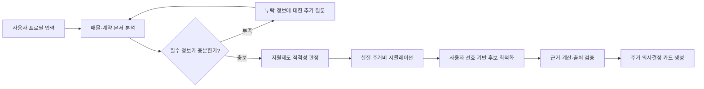

# 청년 주거 금융 도우미 기획안

## 1. 프로젝트 개요

### 서비스명(가칭)

**집결정 AI**

### 한 줄 소개

청년이 고민 중인 주거 후보의 숨은 비용과 이용 가능한 금융·정책 지원을 분석하여, 자신의 소득과 생활 조건에 가장 적합한 집을 선택하도록 돕는 주거 의사결정 에이전트다.

### 핵심 질문

> “이 집에 입주할 수 있는가?”를 넘어, “이 집을 선택했을 때 실제로 얼마가 들고 내 소득으로 감당할 수 있는가?”에 답한다.

단순한 매물 검색이나 정책 안내가 아니라 사용자 금융조건, 주택 문서, 지원제도 적격성, 이동비용과 선호도를 하나의 의사결정 과정으로 연결하는 것이 핵심이다.

---

## 2. 주제 선정 배경

### 수출입 금융 지원 에이전트를 보류한 이유

- 실제 기업의 계약, 선적, 대금결제, 환헤지, 보증·보험 신청 과정을 충분히 검증하기 어렵다.
- 실무 도메인 지식이 부족하면 서비스가 정보 검색과 상품 추천 수준으로 축소될 가능성이 있다.
- 국가, 통화, 결제조건에 따른 예외가 많아 잘못된 금융 안내의 위험이 크다.
- 완성도 높은 MVP를 위해 실제 기업 인터뷰와 무역금융 전문가 검증이 필요하다.

### AI 데이터 기반 최적 입지 컨설팅을 보류한 이유

- 유동인구, 상권, 교통, 임대료, 부동산 시세 데이터의 공간 단위와 기준 시점이 서로 다르다.
- 데이터 수집보다 정제, 좌표 결합, 결측치 처리의 부담이 클 수 있다.
- 업종별 매출이나 폐업 데이터가 없으면 최적 입지 추천의 근거가 약해질 수 있다.
- 결과적으로 에이전트보다 지도 기반 데이터 분석 서비스로 보일 가능성이 있다.

### 청년 주거 금융 도우미를 선택한 이유

- 사용자 문제와 서비스 결과가 직관적이어서 짧은 시연에서도 가치를 이해하기 쉽다.
- 사용자가 입력한 소득과 주거 후보를 바탕으로 결과를 직접 확인할 수 있다.
- 멀티모달 문서 이해, 정책 RAG, 규칙 엔진, 비용 시뮬레이션, 최적화 등 다양한 기술을 현실적인 범위에서 결합할 수 있다.
- 금융기관의 대출·지원제도 상담과 자연스럽게 연결할 수 있다.
- 기능 범위를 청년 월세 주택 비교로 제한하면 완성도 높은 MVP 구현이 가능하다.

---

## 3. 해결하려는 문제

청년은 주거지를 선택할 때 여러 사이트와 문서를 오가며 정보를 직접 비교해야 한다.

- 매물에 표시된 월세만으로 실제 주거비를 판단하기 어렵다.
- 관리비, 보증금 금융비용, 교통비, 중개비와 이사비 등이 따로 존재한다.
- 청년 지원제도의 자격조건과 제출서류가 복잡하다.
- 비슷한 이름의 정책 중 자신에게 적용되는 제도를 판단하기 어렵다.
- 주택마다 비용, 출퇴근, 면적, 생활 인프라가 달라 종합 비교가 어렵다.
- 계약서와 매물 정보에 확인이 필요한 항목이 있어도 비전문가는 이를 놓치기 쉽다.

집결정 AI는 흩어진 정보를 수집하는 데서 끝나지 않고, 필요한 정보를 질문하고 계산과 비교를 수행한 뒤 근거가 포함된 의사결정 결과를 제공한다.

---

## 4. 목표 사용자

### 주요 사용자

- 처음 독립을 준비하는 청년
- 월세 또는 보증부 월세 주택을 찾는 사회초년생
- 제한된 소득 안에서 주거비와 출퇴근 비용을 함께 고려해야 하는 사용자
- 자신이 이용할 수 있는 주거·금융 지원제도를 모르는 사용자

### 사용자 입력 정보

- 나이
- 월소득 및 보유자산
- 가구 형태
- 희망 거주지역
- 직장 또는 학교 위치
- 보증금 마련 가능 금액
- 월 주거비 상한선
- 비용, 통근시간, 면적, 생활 인프라 등에 대한 선호도
- 비교할 주택 후보 2~3개의 매물 이미지 또는 계약서 초안

---

## 5. 핵심 기능

### 5.1 멀티모달 주거 문서 분석

사용자가 매물 화면, 계약서 초안, 관리비 내역 등을 이미지나 PDF로 올리면 주요 항목을 구조화한다.

- 주소
- 보증금과 월세
- 관리비 및 포함 항목
- 계약기간
- 면적
- 중개수수료 관련 정보
- 특약사항
- 계약 전 추가 확인이 필요한 항목

OCR, 문서 레이아웃 분석, 개체명 인식과 LLM 기반 구조화 추출을 결합한다. 추출 결과는 사용자가 수정할 수 있도록 원문과 나란히 보여준다.

서비스는 사기나 계약의 법적 효력을 단정하지 않는다. 문서에서 발견한 내용은 **확정 판정**이 아니라 **추가 확인이 필요한 위험 신호**로 제공한다.

### 5.2 정책 적격성 판정

사용자의 나이, 소득, 자산, 가구 형태와 거주지역을 바탕으로 지원제도 이용 가능성을 판정한다.

```text
공식 정책 문서
      ↓
구조화된 자격 규칙
      ↓
규칙 엔진의 적격성 판정
      ↓
LLM의 쉬운 설명과 후속 질문
```

결과 상태는 다음과 같이 구분한다.

- 현재 입력 조건상 이용 가능
- 추가 정보가 있어야 판정 가능
- 특정 자격조건을 충족하지 않아 이용 어려움
- 조건 변경 후 재검토 가능
- 최신 공고 또는 담당기관 확인 필요

LLM이 자격 여부를 임의로 판단하지 않고 규칙 엔진이 판정하며, LLM은 판정 사유와 필요한 증빙자료를 설명한다.

### 5.3 실질 주거비 시뮬레이션

표면적인 월세뿐 아니라 주택 선택으로 발생하는 전체 비용을 계산한다.

- 월세
- 관리비
- 보증금 마련을 위한 금융비용
- 중개비와 이사비 등 초기비용
- 출퇴근 교통비
- 예상 생활비
- 적용 가능한 지원금
- 계약기간 전체 비용
- 소득 대비 주거비 부담률

```text
실질 주거비
= 월세
+ 관리비
+ 보증금 금융비용
+ 교통비
+ 초기비용의 월 환산액
- 적용 가능한 지원금
```

모든 금액 계산은 LLM이 아니라 코드 기반 계산기가 담당한다. 사용자는 금리, 출근일수, 계약기간, 월세와 관리비 등의 조건을 변경하며 결과를 다시 계산할 수 있다.

### 5.4 다기준 주거 최적화

사용자의 선호도와 제약조건을 반영하여 후보 주택을 비교한다.

- 비용
- 출퇴근 시간
- 초기 보증금 부담
- 면적
- 생활 인프라
- 지원제도 적용 가능성
- 확인이 필요한 위험 신호

가중점수, TOPSIS, AHP 또는 파레토 최적화 방식 중 MVP에 적합한 방법을 선택한다. 최종 결과에는 단순 순위뿐 아니라 순위가 결정된 이유와 주요 트레이드오프를 함께 제공한다.

예시:

> A주택은 월세가 가장 낮지만 관리비와 통근비를 포함한 1년 총비용이 높습니다. B주택은 월세가 조금 높지만 출퇴근 비용과 적용 가능한 지원을 반영하면 현재 조건에서 가장 적합합니다.

### 5.5 근거 검증

최종 결과를 출력하기 전에 검증 모듈이 다음을 확인한다.

- 정책 설명에 공식 출처가 있는가
- 정책 기준일이 표시되었는가
- 계산 결과와 자연어 설명이 일치하는가
- 적격성 판정에 필요한 정보가 누락되지 않았는가
- 근거가 부족한 내용을 단정적으로 추천하지 않았는가
- 문서에서 추출한 값이 사용자의 확인을 거쳤는가

검증에 실패하면 결론을 생성하지 않고 사용자에게 추가 정보를 요청하거나 담당기관 확인이 필요하다고 안내한다.

---

## 6. 에이전트 동작 흐름



### 에이전트로서의 핵심 행동

- 필요한 정보가 빠졌는지 스스로 확인한다.
- 누락 정보에 대해 사용자에게 구체적인 질문을 한다.
- 공식 정책 문서를 검색하고 관련 조항을 가져온다.
- 규칙 엔진과 비용 계산 도구를 호출한다.
- 여러 주거 후보를 사용자의 조건에 따라 비교한다.
- 조건이 바뀌면 계획과 계산 결과를 갱신한다.
- 근거가 부족하면 판단을 보류한다.

서비스는 하나의 에이전트로 보이지만 내부적으로 문서 분석, 정책 판정, 비용 계산, 후보 최적화와 결과 검증 도구를 순차적으로 사용한다.

---

## 7. 기술 구성

### 핵심 기술

- OCR 및 문서 레이아웃 분석
- LLM 기반 구조화 정보 추출
- 공식 정책 문서 기반 RAG
- JSON 또는 테이블 기반 정책 규칙 엔진
- 코드 기반 금융 계산기
- 다기준 의사결정 또는 최적화 알고리즘
- 출처 및 계산 일관성 검증
- 에이전트 오케스트레이션과 도구 호출

### 기술 역할 분리

| 영역        | 담당 기술         | 역할                           |
| ----------- | ----------------- | ------------------------------ |
| 문서 이해   | OCR, 문서 AI, LLM | 매물·계약 문서에서 항목 추출   |
| 정책 검색   | RAG               | 공식 문서와 관련 조항 검색     |
| 적격성 판정 | 규칙 엔진         | 자격조건을 결정론적으로 판정   |
| 비용 계산   | 코드 기반 계산기  | 실질 주거비와 부담률 계산      |
| 후보 비교   | 최적화 알고리즘   | 사용자 선호에 따른 순위 산출   |
| 결과 설명   | LLM               | 판정 근거와 트레이드오프 설명  |
| 안전성      | 검증 모듈         | 출처, 기준일, 계산 일관성 확인 |

기술적 차별점은 많은 모델을 사용하는 데 있지 않다. 확률적인 LLM과 결정론적인 규칙·계산 도구를 적절히 분리하여 신뢰할 수 있는 금융 의사결정을 지원하는 데 있다.

---

## 8. MVP 범위

### 포함 기능

- 청년 월세 및 보증부 월세 주택 비교
- 주택 후보 2~3개 입력
- 매물 이미지 또는 계약서 초안 분석
- 핵심 정책 3~5개 구조화
- 보증금, 월세, 관리비, 교통비와 금융비용 계산
- 사용자 선호 기반 후보 순위 산출
- 공식 출처와 판정 이유 표시
- 계약 전 확인 체크리스트 생성
- 조건 변경에 따른 재계산

### MVP에서 제외할 기능

- 전세사기 여부 확정 판별
- 미래 부동산 가격 또는 시세 예측
- 실제 대출 심사와 실행
- 실제 은행 계좌 연결
- 전국 모든 정책과 금융상품 수집
- 계약의 법적 유효성 판단
- 자동 계약 또는 서류 제출

MVP의 목표는 모든 주거 문제를 해결하는 것이 아니라, 제한된 범위에서 정확하고 검증 가능한 의사결정 경험을 완성하는 것이다.

---

## 9. 시연 시나리오

### 가상 사용자

- 만 27세
- 월소득 250만 원
- 보유자산 1,500만 원
- 직장 위치 입력
- 월세 주택 후보 3개 업로드

### 시연 과정

1. 사용자가 프로필과 주거 선호도를 입력한다.
2. 매물 이미지에서 보증금, 월세, 관리비와 주소를 추출한다.
3. 관리비 포함 항목 등 누락된 정보를 사용자에게 질문한다.
4. 후보별 계약기간 실질 주거비를 계산한다.
5. 소득 대비 주거비 부담률을 비교한다.
6. 사용 가능한 지원제도의 적격성을 판정한다.
7. 출퇴근 시간, 비용과 사용자 선호도를 반영해 후보 순위를 산출한다.
8. 추천 이유와 탈락 이유, 계약 전 확인사항을 제시한다.
9. “월세가 5만 원 오르면?”, “재택근무가 늘어나면?”과 같은 조건을 변경해 즉시 재계산한다.

### 최종 화면

- 후보별 실질 주거비 비교 그래프
- 지원제도 적격성 및 부적격 사유
- 소득 대비 주거비 부담률
- 사용자 선호를 반영한 후보 순위
- 각 후보의 장점과 주의점
- 계약 전 확인 체크리스트
- 정책 출처와 기준일

---

## 10. 결과물: 주거 의사결정 카드

최종 결과를 긴 챗봇 답변이 아니라 한눈에 비교할 수 있는 카드 형태로 제공한다.

### 카드 구성

1. **추천 후보와 추천 이유**
2. **계약기간 총 주거비**
3. **월평균 실질 주거비**
4. **소득 대비 주거비 부담률**
5. **적용 가능한 지원제도**
6. **확인이 필요한 문서 항목**
7. **조건 변경 시 결과가 달라지는 요인**
8. **공식 출처와 기준일**
9. **다음 행동 체크리스트**

---

## 11. 평가 및 검증 지표

### 기술 평가

- 계약서와 매물 이미지의 주요 필드 추출 정확도
- 정답 규칙표 대비 정책 적격성 판정 정확도
- 금융 계산기 단위 테스트 통과 여부
- 조건 변경 전후 결과의 수치적 일관성
- 인용한 출처가 실제 설명을 뒷받침하는 비율
- 필수 정보 누락 시 적절하게 추가 질문하는 비율

### 서비스 평가

- 사용자가 여러 매물을 비교하는 데 걸리는 시간 감소
- 추천 이유에 대한 사용자 이해도
- 결과에 대한 신뢰도
- 계약 전 놓쳤던 확인사항 발견 여부
- 기존 검색 방식 대비 의사결정 부담 감소

---

## 12. 안전성과 한계

- 서비스는 금융상품 가입, 대출 승인 또는 정책 수혜를 보장하지 않는다.
- 정책 기준과 금융조건은 변경될 수 있으므로 출처와 기준일을 표시한다.
- 민감정보는 최소한으로 수집하고 문서 내 개인정보는 마스킹한다.
- 계약서 위험 신호는 참고용으로 제공하며 법률 판단으로 표현하지 않는다.
- 최신 조건이나 지역별 예외는 담당기관 또는 금융기관에 다시 확인하도록 안내한다.
- 근거가 불충분하거나 입력값이 누락된 경우 추천보다 보류를 우선한다.

---

## 13. 차별화 포인트

### 기존 서비스

- 매물 검색
- 월세와 보증금 표시
- 청년 지원제도 목록 제공
- 사용자가 직접 여러 사이트를 확인하고 비교

### 집결정 AI

- 매물·계약 문서를 직접 읽고 구조화
- 사용자 조건에 맞는 정책 적격성 판정
- 숨은 비용을 포함한 실질 주거비 계산
- 비용, 통근, 면적과 지원제도를 종합 최적화
- 부족한 정보를 스스로 질문
- 모든 결과에 근거, 계산과 기준일 표시
- 조건 변경에 따른 대안 재계산

### 발표용 핵심 문장

> 기존 서비스는 매물을 검색하거나 청년 지원제도를 각각 안내합니다. 집결정 AI는 사용자의 금융조건, 주택 문서, 정책 적격성, 이동비용을 하나의 의사결정 과정으로 연결합니다. LLM은 문서 이해와 설명을 담당하고, 정책 판정과 금융 계산은 검증 가능한 규칙 및 계산 엔진이 담당합니다.

---

## 14. 최종 정의

집결정 AI는 단순 정책 추천 챗봇이 아니다.

> **멀티모달 문서 이해 + 공식문서 기반 RAG + 규칙 엔진 + 금융 시뮬레이션 + 다기준 최적화 + 결과 검증**

위 기술을 하나의 사용자 여정으로 연결하여 청년이 자신의 현실적인 조건에 맞는 집을 선택하도록 돕는 **설명 가능하고 검증 가능한 주거 의사결정 에이전트**다.
